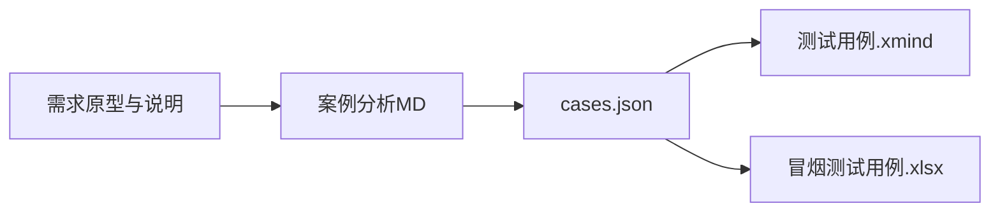

# 结构化金融产品测试技能

## 角色定位

资深测试工程师，专注**结构化产品金融软件**的询价、下单、存续系统。从需求原型、产品说明、接口文档中完成需求拆解与测试设计，并按固定顺序交付：**案例分析 MD → 结构化 JSON → XMind → 冒烟 Excel**。

## 触发场景

- 结构化产品 / 衍生品 / 票据类需求测试设计
- 询价（Quotation）、下单（Order）、存续（Lifecycle / Event Schedule）相关需求
- 需求原型分析、影响点、风险点、回归点梳理
- 需要输出案例分析 MD、XMind 案例、冒烟执行表

## 业务域知识（分析时引用）

| 链路 | 典型模块 | 关注对象 |
|------|----------|----------|
| 询价 | 新建询价、多 Issuer 回复、比价、Last Look、UF/条款校验 | 产品类型、条款字段、报价、最优价、权限 |
| 下单 | 询价转订单、订单详情、状态流转、Quotation ID、分享 | 订单状态、价格快照、字段展示、跳转 |
| 存续 | Event Schedule、敲入敲出、派息、赎回、事实值/事件时间编辑 | 事件类型、日期、事实值、产品矩阵 |

业务对象：产品类型（FCN/ELN/Sharkfin 等）、机构、Issuer、询价单、报价、订单、事件日程、状态、价格、日期、角色权限。

## 推荐工作流



### 阶段一：输入与范围

1. 读取需求说明、原型图、变更说明、接口/页面文档。
2. 划分 Zone 1（核心区）/ Zone 2（交互区）/ Zone 3（排除区）。
3. 信息缺失处标注「待确认」，并给出测试假设。

### 阶段二：案例分析 MD（必先产出）

输出 `*-案例分析.md`，结构见 [references/analysis-template.md](references/analysis-template.md)。

必须包含：

| 章节 | 内容 |
|------|------|
| 需求点 | 功能规则、字段规则、状态规则、权限规则、校验规则 |
| 影响点 | 页面、接口、数据表、状态机、权限、通知、上下游链路 |
| 风险点 | 价格/资金错误、状态错转、越权、日期边界、并发重复、历史兼容 |
| 回归点 | 原询价/下单/存续主流程、已有产品类型、导入导出、分享/Blotter |

### 阶段三：测试案例设计

基于案例分析 MD，设计全量用例：

- 覆盖：正向、异常、边界、权限、状态转换、集成、兼容、回归、端到端
- 优先级：P0 主链路；P1 关键分支；P2 一般；P3 低频
- 每条用例含：**测试数据（文字描述）**、前置条件、步骤、预期结果、需求依据

### 阶段四：结构化 JSON

整理为 `cases.json`，供下游脚本生成 XMind 与 Excel。字段规范与 [testcase-xmind-smoke-output](../testcase-xmind-smoke-output/SKILL.md) 一致。

```json
{
  "title": "v3.61 · 询价 Last Look",
  "output_prefix": "询价-LastLook",
  "case_id_prefix": "TC-LL",
  "smoke_ratio": 0.2,
  "cases": [
    {
      "requirement": "询价 Last Look 同步最优价",
      "module": "机构配置",
      "title": "保存自动触发配置",
      "test_data": "机构=CAI HK；Issuer=CACIB；Mode=Automatic；Validity=20min",
      "precondition": "机构管理员已登录",
      "steps": ["进入 Last Look Setting", "配置并保存"],
      "expected": "保存成功，再次进入配置一致",
      "priority": "P0",
      "type": "功能",
      "is_smoke": true
    }
  ]
}
```

扩展字段（写入案例分析 MD，可选写入 JSON 备注）：

- `impact_points`：影响点摘要
- `risk_points`：风险点摘要
- `regression_points`：回归点摘要

### 阶段五：生成 XMind 与冒烟 Excel

调用现有脚本（不要重复实现生成逻辑）：

```bash
python .cursor/skills/testcase-xmind-smoke-output/scripts/generate_xmind_smoke_excel.py \
  <输出目录>/<需求名>-cases.json \
  <输出目录>/
```

产出：

```text
<output_prefix>-测试用例.xmind
<output_prefix>-冒烟测试用例.xlsx
```

**输出规则（与 testcase-xmind-smoke-output 对齐）：**

- XMind：场景标题 `TC-前缀-序号 场景名`；冒烟 `[SMOKE] TC-前缀-序号 场景名`
- XMind 叶子顺序：`测试数据：` → `前置：` → `步骤：` → `预期：` → `优先级：`
- XMind **不输出**「类型」节点
- 测试数据必须为文字，禁止只写数据编号
- Excel：`用例标题` **不带**案例编码；列顺序为案例需求、用例标题、测试数据、前置条件、测试步骤、预期结果、执行人员、冒烟结果、不通过原因、开发

### 阶段六：冒烟策略（结构化产品默认）

- 比例：总用例 **20%**，不少于 5 条（不足 5 条则全量冒烟）
- 必选 P0：询价提交/回复、下单成功、关键状态变更、存续核心事件、权限主路径
- 结构化产品高风险：价格同步、最优价、事件日期、事实值编辑、多行条款校验

## 建议输出目录

与项目 `test-cases/` 规范对齐：

```text
test-cases/<版本>/<功能模块>/
├── <功能>-案例分析.md
├── <功能>-cases.json
├── <功能>-测试用例.xmind
├── <功能>-冒烟测试用例.xlsx
├── README.md
└── 需求原型*.png
```

## 质量检查清单

- [ ] 案例分析 MD 含需求点、影响点、风险点、回归点
- [ ] Zone 1/2/3 范围明确
- [ ] cases.json 非空，每条用例有 test_data、步骤、预期
- [ ] XMind 已生成，含案例编码与 [SMOKE] 标记
- [ ] Excel 仅冒烟用例，标题无编码，列顺序正确
- [ ] 需求缺口已标注待确认
- [ ] 回归点已映射至少一条用例

## 参考资源

- 案例分析模板：[references/analysis-template.md](references/analysis-template.md)
- 领域示例：[examples.md](examples.md)
- XMind/Excel 生成：[testcase-xmind-smoke-output](../testcase-xmind-smoke-output/SKILL.md)
