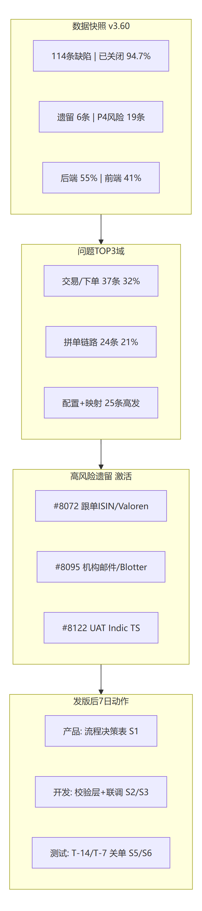
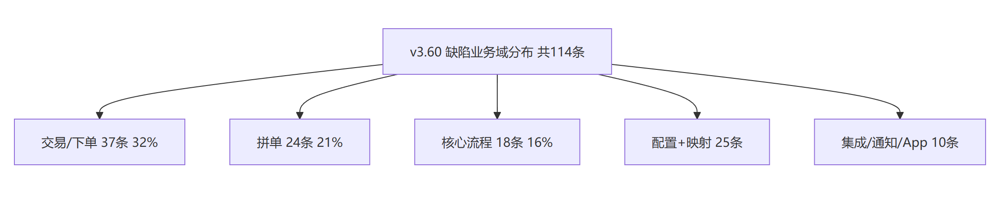
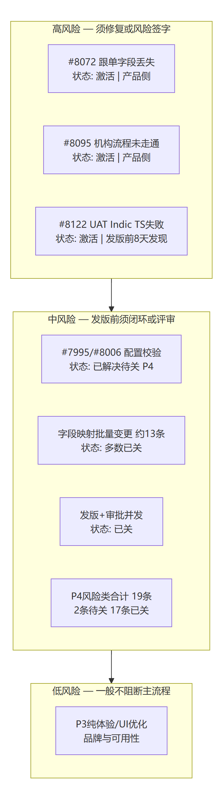
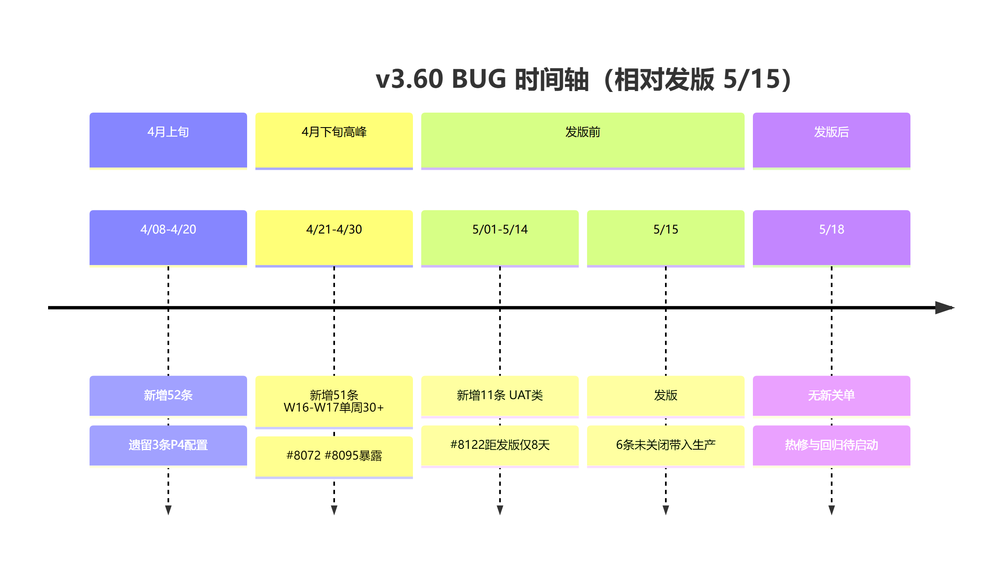
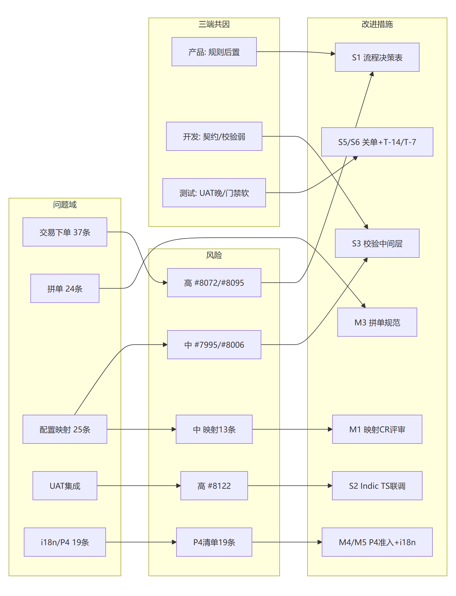
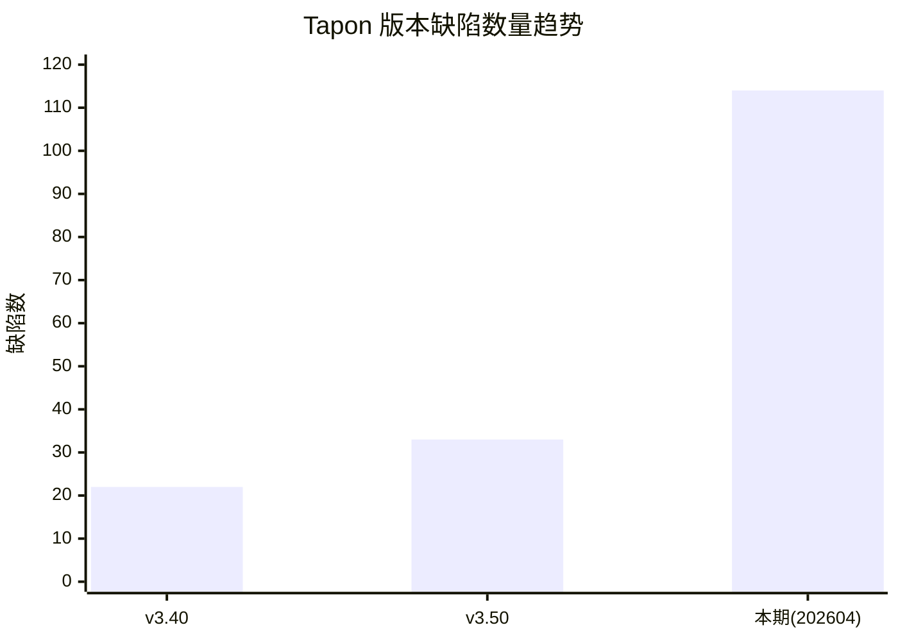

# Tapon 项目缺陷复盘总结报告

| 项目 | 内容 |
|------|------|
| **报告名称** | Tapon 项目缺陷复盘总结（202604 周期） |
| **数据来源** | `Tapon-Bug列表-202604.xlsx`（BUG列表工作表） |
| **统计周期** | 2026-04-08 ～ 2026-05（以创建日期为准） |
| **编制日期** | 2026-05-18 |
| **对比基线** | v3.40 版本 22 个缺陷；v3.50 版本 33 个缺陷 |
| **复盘图** | 本节 [1.1 复盘总览图](#11-复盘总览图评审用)；完整叙述见 [Tapon-v3.60-BUG复盘总结.md](Tapon-v3.60-BUG复盘总结.md#复盘总览图评审用) |

---

## 一、执行摘要

本期基于 Excel 台账共纳入 **114** 条有效缺陷记录（Bug 编号 #7990～#8132），较 v3.50（33 个）与 v3.40（22 个）在**绝对数量**上显著上升。结合缺陷标题与模块分布判断，主要原因包括：**Tapon 交易/下单链路功能扩张**、**拼单与字段映射场景增多**、**多语言/国际化与配置校验类问题集中暴露**，以及本期测试覆盖范围（含 UAT、App-Tapon、Marketplace 等）明显大于前两版。

质量闭环方面表现尚可：**已关闭 108 条（94.7%）**；未关闭 6 条（含 3 条激活、3 条已解决待关）。已关闭缺陷从创建到关闭的修复周期**中位数 1 天、均值 2.25 天**，整体响应较快，但 **P4（较高优先级）缺陷占比 16.7%（19/114）**，配置校验与国际化类问题需从需求与设计阶段前置防控。

**核心结论：**

1. 版本间缺陷数呈持续上升趋势（22 → 33 → 114*），需在下一版本控制范围增量并加强回归策略。  
2. 缺陷高度集中在 **Tapon 交易/下单（37）**、**拼单（24）**、**Tapon 核心流程（18）**、**配置/字段（12）** 四大域。  
3. **后端缺陷 55%**，略高于前端（41%），说明业务规则、数据一致性、流程编排仍是主要风险面。  
4. 仍有 **3 条激活缺陷**（含 2 条产品侧流程类、1 条 UAT 集成类），发布前应完成闭环或明确风险接受。

\* 本期 114 条为 Excel 全量统计口径；与 v3.40/v3.50「单版本缺陷数」对比时，需确认历史版本是否采用相同统计范围（功能范围、测试周期、是否含 UAT/优化类）。若历史仅为核心功能 Bug，则本期增幅部分来自范围扩大，建议在版本管理中统一口径。

### 1.1 复盘总览图（评审用）

> 与 [Tapon-v3.60-BUG复盘总结.md](Tapon-v3.60-BUG复盘总结.md#图表索引) 同步；PNG 源文件见 `assets/tapon-v3.60-retro/`。

| 图 | 说明 |
|----|------|
| 图1 | 复盘全景：114 条 / 遗留 6 / 激活 3 |
| 图2 | 问题域占比：下单 37、拼单 24、核心 18 等 |
| 图3 | 风险矩阵：高 #8072/#8095/#8122 |
| 图4 | 发版时间轴：5/15 带病发布 6 条 |
| 图5 | 问题 → 风险 → 改进（S1～S6 / M1～M6） |

---

## 二、版本缺陷趋势对比

### 2.1 数量对比

| 版本/周期 | 缺陷总数 | 较上一版本增量 | 环比增长率 |
|-----------|----------|----------------|------------|
| **v3.40** | 22 | — | — |
| **v3.50** | 33 | +11 | **+50.0%** |
| **本期（202604 台账）** | **114** | +81（相对 v3.50） | **+245.5%**（相对 v3.50） |

### 2.2 趋势解读

- **v3.40 → v3.50**：缺陷数增加 11 个（+50%），属于中等幅度上升，常见于功能迭代后测试覆盖面扩大。  
- **v3.50 → 本期**：台账显示 114 个，增幅显著。除质量波动外，更可能叠加了：**统计周期更长**（4 月集中 103 条 + 5 月 11 条）、**业务模块更多**（App、Marketplace、邮件通知、字段映射等）、**优化与体验类缺陷纳入**等因素。  
- **建议**：后续版本统一「单版本缺陷」定义（如：仅计 Release 分支、仅计 SIT/UAT 正式轮次、是否含 P4 体验类），便于横向对比。

---

## 三、本期缺陷总体概况

### 3.1 基本指标

| 指标 | 数值 |
|------|------|
| 缺陷总数 | 114 |
| Bug 编号区间 | #7990 ～ #8132 |
| 已关闭 | 108（94.7%） |
| 已解决（待关闭） | 3（2.6%） |
| 激活（未解决） | 3（2.6%） |
| 优先级 P3 | 95（83.3%） |
| 优先级 P4 | 19（16.7%） |
| 重复标题记录 | 1 组（【Tapon配置】金额校验类，出现 2 次） |

### 3.2 解决端分布

| 解决端 | 数量 | 占比 |
|--------|------|------|
| 后端 | 63 | 55.3% |
| 前端 | 47 | 41.2% |
| 产品 | 3 | 2.6% |
| 未标注 | 1 | 0.9% |

后端占比过半，与「下单流程、字段映射、配置默认值、日志与国际化」等类型缺陷相符。

### 3.3 修复效率（已关闭缺陷，创建日 → 关闭日）

| 指标 | 天数 |
|------|------|
| 平均修复周期 | 2.25 天 |
| 中位修复周期 | 1.0 天 |
| 最长修复周期 | 11.73 天 |

| 修复周期区间 | 数量 | 占比（已关闭 108 条） |
|--------------|------|------------------------|
| 0～1 天 | 54 | 50.0% |
| 2～3 天 | 23 | 21.3% |
| 4～7 天 | 25 | 23.1% |
| 8～14 天 | 6 | 5.6% |
| 15 天以上 | 0 | 0% |

半数缺陷在 **1 天内关闭**，说明研发与测试协同效率较好；仍有约 **5.6%** 超过 8 天，建议对长周期单建立专项跟踪。

---

## 四、缺陷分布分析

### 4.1 业务域分布（按标题语义归类）

| 业务域 | 数量 | 占比 | 说明 |
|--------|------|------|------|
| Tapon 交易/下单 | 37 | 32.5% | 跟单、意向单、订单同步、ISIN/Valoren 带入等 |
| 拼单相关 | 24 | 21.1% | 拼单卡片、详情、分享、推送、意向单 ID 等 |
| Tapon 核心流程 | 18 | 15.8% | 发起、上架/下架、修改订单、卡片状态等 |
| Tapon 配置/字段 | 12 | 10.5% | 金额校验、字段映射、空值返回 0 等 |
| Tapon 通知/邮件 | 5 | 4.4% | 到期下架通知、邮件字段缺失等 |
| Marketplace | 4 | 3.5% | 列表刷新、BEN 默认值等 |
| 日志/审计 | 3 | 2.6% | 日志显示、翻译、操作记录时间 |
| App-Tapon | 2 | 1.8% | 移动端详情、状态卡片 |
| 其他（权限、审批、UAT、UI 等） | 13 | 11.4% | 分散但需专项关注 UAT/集成 |

### 4.2 高频模块标签（Excel 标题【】内标签 TOP）

| 模块标签 | 数量 |
|----------|------|
| tapon字段映射 | 13 |
| app-tapon | 12 |
| 发起tapon | 9 |
| tapon | 9 |
| tapon通知 | 6 |

**字段映射（13）** 与 **发起/核心流程** 叠加，说明新版本在「产品参数 → 展示/下单」链路上变更密集，是缺陷温床。

### 4.3 缺陷关键词特征（标题词频）

| 关键词 | 出现次数 | 典型问题 |
|--------|----------|----------|
| 显示 | 33 | 英文模式显示不全、字段未展示、UI 对齐 |
| 字段 | 18 | 映射错误、缺字段、默认值异常 |
| 下单 | 17 | 跟单流程、审批后数据未带入 |
| 列表 | 9 | 筛选、标识、刷新重复请求 |
| 邮件/通知 | 13 | 模板缺字段、到期通知 |
| 校验 | 3 | 金额/面值关系未校验（但影响大，多为 P4） |

### 4.4 时间分布

**按月创建：**

| 月份 | 新增缺陷数 |
|------|------------|
| 2026-04 | 103 |
| 2026-05 | 11 |

**按周创建（ISO 周）：**

| 周次 | 新增 |
|------|------|
| 2026-W14 | 14 |
| 2026-W15 | 28 |
| 2026-W16 | 30 |
| 2026-W17 | 31 |
| 2026-W18 | 10 |
| 2026-W19 | 1 |

4 月中下旬（W16～W17）为缺陷高峰期，与版本集中联调、回归及发版前冲刺节奏一致，建议在类似窗口**提前加测配置类与全流程场景**。

---

## 五、人员与协作分析

### 5.1 解决者工作量 TOP

| 解决者 | 关闭/解决数量 | 占比 |
|--------|---------------|------|
| 肖赣丰 | 20 | 17.5% |
| 蒋杰 | 16 | 14.0% |
| 林桃君 | 16 | 14.0% |
| 胡明明 | 15 | 13.2% |
| 罗嘉胜 | 14 | 12.3% |
| 黄浩 | 12 | 10.5% |
| 彭超 | 11 | 9.6% |
| 其他 | 10 | 8.8% |

前端同学（林桃君、罗嘉胜、黄浩）在 **P4 体验/国际化/UI** 类缺陷中占比较高；后端（肖赣丰、胡明明、彭超）集中在 **配置、日志、流程与数据**。

### 5.2 协作观察

- **前后端缺陷比约 1.34 : 1**，联调与接口契约问题仍可能隐藏在「显示/字段」类缺陷背后，建议加强 **API 契约测试** 与 **字段映射表** 评审。  
- **产品侧 3 条**（含 2 条仍激活的流程定义类），说明部分规则在测试阶段才澄清，宜在需求评审阶段输出 **流程决策表**。

---

## 六、较高优先级（P4）缺陷复盘

本期共 **19 条 P4**，占 16.7%。已关闭 17 条，**未关闭 2 条**（均为已解决待关，配置校验类）。

### 6.1 P4 主题聚类

| 主题 | 代表问题 | 根因归纳 |
|------|----------|----------|
| 配置与金额校验 | 最大/最小投资金额与面值未校验；配置为空返回 0；可输入小数 | 规则未在前后端同时约束；边界值与空值语义未统一 |
| 国际化/多语言 | 英文显示不全、按钮/日志/描述未翻译 | i18n 覆盖清单不完整；发版前缺少多语言走查 |
| UI/体验 | 黑暗模式、字段对齐、图标置灰、列表站位 | 设计规范与组件库未统一；回归用例不足 |
| 性能/实现 | Marketplace 列表重复请求接口 | 前端生命周期或防抖策略缺失 |

### 6.2 未关闭 P4 清单

| Bug 编号 | 标题 | 状态 | 解决端 |
|----------|------|------|--------|
| 7995 | 【Tapon配置】最大投资金额、最低起投金额和面值之间未做校验 | 已解决 | 后端 |
| 8006 | 【配置】Denomination/Minimum Investment 等配置为空返回为 0 | 已解决 | 后端 |

**行动项：** 尽快完成验证关闭；并在配置中心增加 **统一校验中间层**，避免同类问题在 v3.60+ 再次出现。

---

## 七、未关闭缺陷与发布风险

| Bug 编号 | 标题 | 状态 | 解决端 | 风险说明 |
|----------|------|------|--------|----------|
| 7995 | 【Tapon配置】金额校验 | 已解决 | 后端 | P4，待关闭 |
| 8006 | 【配置】空配置返回 0 | 已解决 | 后端 | P4，待关闭 |
| 8015 | 【发起tapon】询价发起带入 Gross Margin | 已解决 | 后端 | 待关闭 |
| 8072 | 【tapon下单】跟单审批未带入 ISIN/Valoren | **激活** | 产品 | **流程/规则未定论，影响跟单正确性** |
| 8095 | 【tapon下单】邮件下单/Blotter 流程未走对应分支 | **激活** | 产品 | **机构合约场景流程缺失** |
| 8122 | 【UAT】银河机构订单生成 Indic TS 文件报错 | **激活** | 未标注 | **UAT 集成阻塞风险** |

**发布建议：** 8072、8095、8122 三条激活缺陷需在发布评审中明确：**修复版本 / 规避方案 / 是否接受遗留风险**；三条「已解决」应完成回归并关闭台账。

---

## 八、根因分析与共性问题

### 8.1 根因分类（鱼骨图式归纳）

| 根因类别 | 表现 | 本期占比倾向 |
|----------|------|----------------|
| **需求/规则不清晰** | 跟单流程、issuer 邮件/Blotter 分支、审批边界 | 产品激活类、流程类偏多 |
| **设计与校验缺失** | 金额关系、空值语义、枚举不一致 | 配置/字段域 P4 集中 |
| **变更影响面大** | 字段映射 13 处、多产品类型（ELN/FCN/BEN） | 映射与下单域缺陷多 |
| **国际化与 UI 规范** | 翻译遗漏、英文截断、黑暗模式 | P4 中前端占比高 |
| **测试覆盖不足** | UAT 文件生成、发版窗口审批报错 | 集成与时机类问题 |

### 8.2 与 v3.40 / v3.50 的差异（推断）

| 维度 | v3.40/v3.50（22～33） | 本期（114） |
|------|------------------------|-------------|
| 功能范围 | 相对集中 | 含 App、Marketplace、邮件、字段映射等 |
| 缺陷类型 | 以功能错误为主（推断） | 功能 + 体验 + i18n + 优化并存 |
| 测试强度 | 较低基数 | 4 月单周峰值 30+，回归强度高 |

---

## 九、改进建议与行动计划

### 9.1 短期（下一迭代 / 发版前）

| 序号 | 措施 | 责任人建议 | 验收标准 |
|------|------|------------|----------|
| 1 | 关闭 6 条未关缺陷，重点攻关 8072、8095、8122 | 产品 + 开发 + 测试 | 台账清零或风险签字 |
| 2 | 对【Tapon配置】金额/面值/起投额建立 **前后端共用校验规则** | 后端牵头 | 用例覆盖边界与空值 |
| 3 | 发布前执行 **中英双语 + 黑暗模式** 检查清单 | 前端 + 测试 | P4 i18n 类零新增 |
| 4 | 字段映射变更必须附 **映射表 + 影响面分析** | 开发 + 测试 | 映射类缺陷环比下降 |

### 9.2 中期（下 2～3 个版本）

| 序号 | 措施 | 目标 |
|------|------|------|
| 1 | 统一版本缺陷统计口径，与 v3.40/v3.50 对齐对比 | 趋势可解释 |
| 2 | 建立 Tapon **全流程自动化回归**（发起→审批→跟单→通知） | 下单域缺陷 ↓30% |
| 3 | 拼单 + Marketplace **契约测试 / 接口幂等** | 减少重复请求、数据不一致 |
| 4 | UAT 案例前置到 SIT，机构级集成尽早介入 | UAT 激活类归零 |

### 9.3 长期（质量体系建设）

- 在需求阶段引入 **可测试性评审** 与 **流程决策表**。  
- 对 v3.50 → 本期缺陷激增做 **正式度量复盘**（范围 vs 质量），纳入版本 OKR。  
- 设定下版本缺陷目标（示例）：在**同等统计口径**下，较本期 **下降 20%**，P4 占比 **< 12%**。

---

## 十、附录

### 附录 A：数据字段说明（Excel）

| 列名 | 说明 |
|------|------|
| Bug标题 | 缺陷描述 |
| Bug状态 | 已关闭 / 已解决 / 激活 |
| 解决者 | 研发处理人 |
| 解决端 | 后端 / 前端 / 产品 |
| Bug编号 | 唯一编号 |
| 创建日期 / 解决日期 / 关闭日期 | 生命周期时间 |
| 优先级 | 3（一般）、4（较高） |

### 附录 B：版本对比数据（用户提供的基线）

- **v3.40 版本缺陷数：22**  
- **v3.50 版本缺陷数：33**  
- **本期 Excel 台账缺陷数：114**

### 附录 C：统计说明与局限性

1. 「BUG分析」工作表为空，本报告仅基于「BUG列表」工作表。  
2. 模块归类由标题关键词规则自动聚合，与人工模块划分可能存在 ±1～2 条误差。  
3. 与历史版本对比时，若统计口径不一致，环比增幅仅供参考，建议质量负责人确认后更新第二节表格。

---

**报告结束**

*本报告由 `Tapon-Bug列表-202604.xlsx` 自动汇总生成，基线数据 v3.40=22、v3.50=33 由项目方提供。*

*复盘图 PNG / Mermaid 源文件：`assets/tapon-v3.60-retro/`（与精简总结同步）。*
