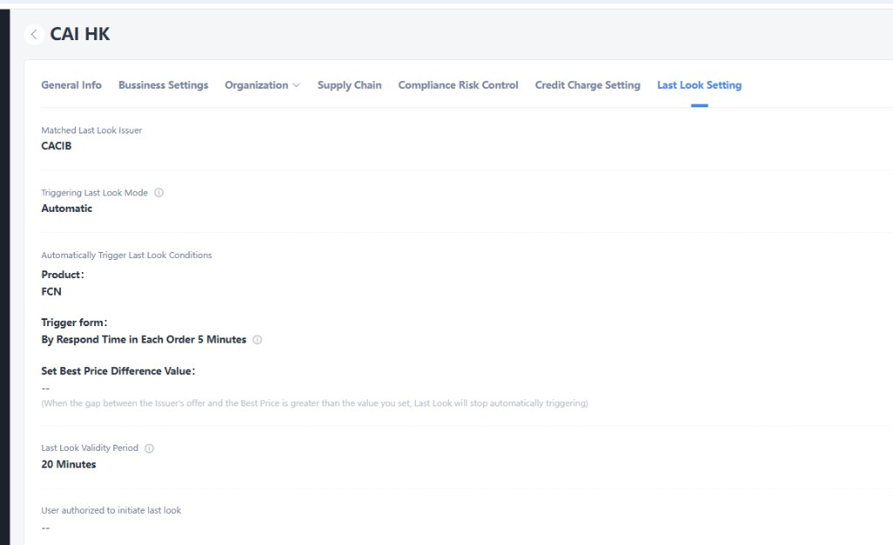

# 02 机构侧 Last Look 配置

[← 返回知识库首页](./README.md)

配置入口：**Organization → Last Look Setting**（与 General Info、Business Settings 等同级 Tab）。配置**归属机构**，对本机构下询价/Lastlook 行为生效。

---

## 2.1 配置界面基线

*图：机构「CAI HK」Last Look Setting 示例（配置基线）*

## 2.2 配置项说明

| 配置项（界面英文） | 说明 | 示例值 |
|-------------------|------|--------|
| **Matched Last Look Issuer** | 适用 Last Look 的 Issuer；仅当询价中该 Issuer 存在非最优有效回复时，才进入 Last Look 候选 | `CACIB` |
| **Triggering Last Look Mode** | 发起模式：**Manual**＝仅授权用户手工发起；**Automatic**＝满足 §2.3 条件时系统自动创建申请 | `Automatic` |
| **Automatically Trigger Last Look Conditions** | 自动模式下的触发条件（见 §2.3） | 见下文 |
| **Last Look Validity Period** | 同步回复申请在「待确认」状态下的**有效时长**；超时置为已失效 | `20 Minutes` |
| **User authorized to initiate last look** | 手动模式下允许发起 Last Look 的机构用户（可多选）；自动模式下可为空或仅作审计/应急手工 | `--`（未配置） |

## 2.3 自动触发条件（Automatically Trigger Last Look Conditions）

当 **Triggering Last Look Mode = Automatic** 时，系统按机构配置校验是否自动创建同步回复申请：

| 子项 | 说明 | 示例 |
|------|------|------|
| **Product** | 仅对指定产品类型询价生效 | `FCN` |
| **Trigger form** | 触发形式，如按单笔订单内回复耗时触发 | `By Respond Time in Each Order 5 Minutes`（每笔订单内回复满 5 分钟触发评估） |
| **Set Best Price Difference Value** | 最优价差阈值：当 **Issuer 报价与当前最优价的差距** 大于设定值时，**停止自动触发** Last Look | 未设置（`--`）表示不按价差拦截；设置后按数值比较 |

### 自动触发评估时机（建议实现）

1. Issuer 产生/更新有效价格回复；
2. 本询价已能计算最优价，且该 Issuer 回复**非最优**；
3. 产品、Matched Issuer、Trigger form 时间条件均满足；
4. 若配置了 Best Price Difference Value，则 `|issuer_price - best_price|` ≤ 设定值；
5. 无冲突的待确认/已确认申请（见 [05-状态与规则.md](./05-状态与规则.md) §5.3）；
6. 创建申请并通知 Issuer；申请有效期取 **Last Look Validity Period**。

## 2.4 手动发起（Manual）

当 **Triggering Last Look Mode = Manual** 时：

- 系统**不**按 §2.3 自动创建申请；
- 具备权限的机构用户（**User authorized to initiate last look**）在 Lastlook 页面对非最优 Issuer **手工发起**同步回复申请；
- 未配置授权用户时，禁止手工发起并提示配置机构管理员。

自动模式下，授权用户仍可**手工补发**申请（若业务允许），以机构策略为准；默认：**自动模式优先由系统触发，手工仅对未自动覆盖且仍非最优的 Issuer 可补发**（待产品确认，见 [08-附录-数据字段.md](./08-附录-数据字段.md) §8.4）。

## 2.5 与 Issuer 端配置关系

机构配置需与 [03-Issuer端配置.md](./03-Issuer端配置.md) 中 **Matched Last Look Buyside** 行配对生效：机构 `Matched Last Look Issuer` ↔ Issuer 表中对应 Buyside 行。
