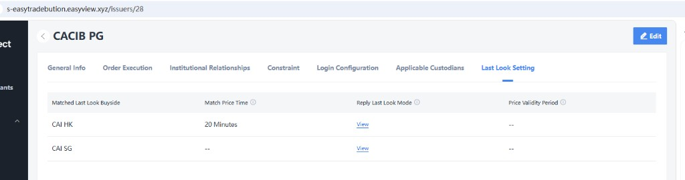
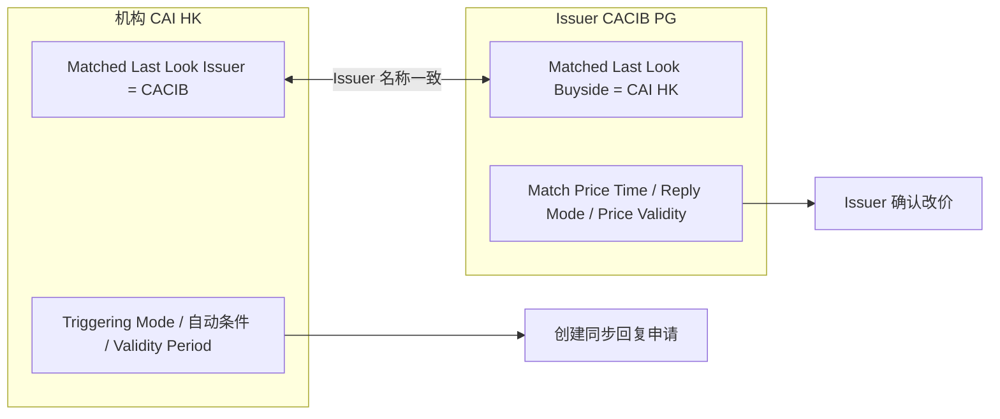

# 03 Issuer 端 Last Look 配置

[← 返回知识库首页](./README.md)

配置入口：**Issuers → {Issuer 名称} → Last Look Setting**（与 General Info、Order Execution、Institutional Relationships 等同级 Tab）。配置**归属 Issuer**，定义该 Issuer 与哪些机构（Buyside）开展 Last Look，以及**回复侧**的确认方式与时效。

> 与 [02-机构配置.md](./02-机构配置.md) 成对：机构侧配置「向谁发起、如何触发」；Issuer 侧配置「接受哪家机构的 Last Look、如何回复确认」。

---

## 3.1 配置界面基线

*图：Issuer「CACIB PG」Last Look Setting 示例（按 Buyside 分行配置）*

## 3.2 列表字段说明

界面为**按机构（Buyside）分行**的表格，每行对应一家匹配的机构：

| 配置项（界面英文） | 说明 | 示例值 |
|-------------------|------|--------|
| **Matched Last Look Buyside** | 与本 Issuer 启用 Last Look 的机构（Organization / Buyside） | `CAI HK`、`CAI SG` |
| **Match Price Time** | 与该 Buyside 询价场景下的**匹配价格时间窗口**（可与机构侧 Trigger form 时间条件协同，具体对齐规则见 §3.4） | `20 Minutes` / `--`（未配置） |
| **Reply Last Look Mode** | **回复 Last Look 模式**；列表页为 **View** 链接，点击进入子配置（邮件 / 自动 / 手工，见 §3.3） | `View` |
| **Price Validity Period** | 本 Issuer 对该 Buyside 回复价格的**有效期**；未配置时 `--` | `--` / 可配置时长 |

- 同一 Issuer 可配置**多行** Buyside（如同时服务 CAI HK、CAI SG），各行参数独立。
- 未配置 Match Price Time / Price Validity Period 的行（`--`）表示该维度不限制或沿用系统/机构默认值（待产品确认，见 [08-附录-数据字段.md](./08-附录-数据字段.md)）。

## 3.3 Reply Last Look Mode（回复侧，View 详情）

点击 **View** 进入该 Issuer × Buyside 的回复模式子配置，决定 Issuer **如何确认**机构发起的同步回复申请（对应 [04-业务流程.md](./04-业务流程.md) §4.3）：

| 模式 | 说明 |
|------|------|
| **邮件（Email）** | 向 Issuer 联系人发送确认/拒绝链接，操作结果回写系统。 |
| **自动（Automatic）** | 按 Issuer 预置规则自动接受或拒绝（如始终接受 Last Look 同步申请）。 |
| **手工（Manual）** | Issuer 用户在系统待办 / Last Look 待确认列表中手工确认或拒绝。 |

与机构侧 **Triggering Last Look Mode**（手动/自动**发起**申请）相互独立：

| 维度 | 配置位置 | 作用 |
|------|----------|------|
| 申请**创建** | 机构 Organization → Last Look Setting | Manual / Automatic 触发同步回复申请 |
| 申请**确认** | Issuer → Reply Last Look Mode（View） | 邮件 / 自动 / 手工确认是否改价 |

## 3.4 机构端与 Issuer 端配置匹配

Last Look 全流程生效需**双向匹配**：

| 匹配项 | 机构侧 | Issuer 侧 | 规则 |
|--------|--------|-----------|------|
| 主体配对 | Matched Last Look **Issuer** | Matched Last Look **Buyside** | 询价所属机构 = Issuer 表中 Buyside 行；询价参与 Issuer = 机构配置的 Issuer |
| 时间窗口 | Trigger form（如每笔订单回复满 5 分钟）、Last Look Validity Period | Match Price Time | 建议：申请有效期不超过双方时间配置的较严限制；实现时需统一时钟与起算点（待产品确认） |
| 价格时效 | — | Price Validity Period | Issuer 回复价在有效期内方可参与 Last Look 确认；过期则申请失效或不可确认 |
| 发起 vs 确认 | Triggering Last Look Mode | Reply Last Look Mode | 独立配置，互不影响 |

**示例（与配置基线图一致）：**

- 机构 **CAI HK**：Matched Issuer = `CACIB`，Automatic + Validity 20 分钟。
- Issuer **CACIB PG**：Buyside 行 `CAI HK`，Match Price Time = 20 分钟，Reply Mode 通过 View 配置为邮件/自动/手工之一。

仅当询价同时满足机构自动/手动条件 **且** 命中 Issuer 侧对应 Buyside 行时，才创建申请并向该 Issuer 按 Reply Mode 通知。

## 3.5 维护与权限

| 角色 | 权限 |
|------|------|
| Issuer 管理员 | 在 Issuer 详情页维护 Last Look Setting 表格及 Reply Mode 子配置 |
| 机构管理员 | 仅维护本机构 [02-机构配置.md](./02-机构配置.md)，不可修改 Issuer 端表格 |
| 系统 | 校验双向匹配；不匹配时不创建申请或提示配置缺失 |

## 3.6 相关文档

- 机构侧配置：[02-机构配置.md](./02-机构配置.md)
- 端到端流程：[04-业务流程.md](./04-业务流程.md)
- 申请状态与失效：[05-状态与规则.md](./05-状态与规则.md)

---

[← 机构配置](./02-机构配置.md) · [下一章：业务流程 →](./04-业务流程.md)
