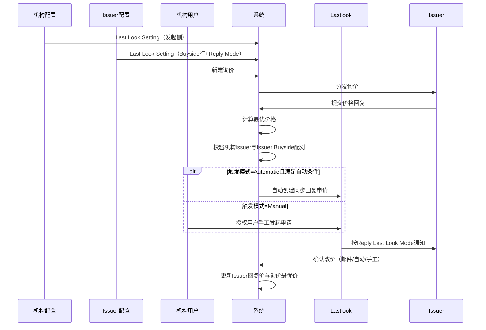

# 04 业务流程

[← 返回知识库首页](./README.md)

---

## 4.1 主流程概览

## 4.2 流程步骤

| 步骤 | 角色 | 动作 | 说明 |
|------|------|------|------|
| 0a | 机构管理员 | 维护机构 Last Look Setting | 详见 [02-机构配置.md](./02-机构配置.md)。 |
| 0b | Issuer 管理员 | 维护 Issuer Last Look Setting | 按 Buyside 配置 Match Price Time、Reply Mode 等。详见 [03-Issuer端配置.md](./03-Issuer端配置.md)。 |
| 1 | 机构用户 | 新建询价 | 创建询价单并邀请参与 Issuer。 |
| 2 | Issuer | 回复价格 | 提交有效价格回复。 |
| 3 | 系统 | 计算最优价格 | 同一询价下全体 Issuer 有效回复参与比价。 |
| 3b | 系统 | 双向配置校验 | 机构 Matched Issuer 与 Issuer 侧 Matched Buyside 须配对；未配对则不创建申请。 |
| 4a | 系统 | **自动发起**（Automatic） | 满足机构自动条件且非最优时创建申请；有效期取机构 Last Look Validity Period。 |
| 4b | 机构用户 | **手动发起**（Manual） | 授权用户在 Lastlook 对非最优 Issuer 发起申请。 |
| 5 | 系统 | 创建申请 | 状态「待确认」；一次性约束见 [05-状态与规则.md](./05-状态与规则.md) §5.3。 |
| 6 | Issuer | 确认改价 | 按 **Reply Last Look Mode**（邮件 / 自动 / 手工）处理，见 §4.3。 |
| 7 | 系统 | 更新最优价 | 确认后最优价 = 该 Issuer 确认后回复价。 |
| 8 | 系统 | 超时/拒绝/关闭 | 超过机构 Validity Period、Issuer Price Validity 过期、询价关闭等 → 已失效。 |

## 4.3 Issuer 确认方式（回复侧）

配置入口：**Issuer → Last Look Setting → Reply Last Look Mode（View）**，详见 [03-Issuer端配置.md](./03-Issuer端配置.md) §3.3。

| 方式 | 说明 |
|------|------|
| **邮件** | 邮件链接确认或拒绝。 |
| **自动** | Issuer 预置规则自动接受/拒绝。 |
| **手工** | Issuer 在系统待办中操作。 |

与机构侧 **Triggering Last Look Mode** 独立：机构配置决定**谁创建申请**；Issuer **Reply Last Look Mode** 决定**谁确认申请**。

---

[← Issuer 配置](./03-Issuer端配置.md) · [下一章：状态与规则 →](./05-状态与规则.md)
