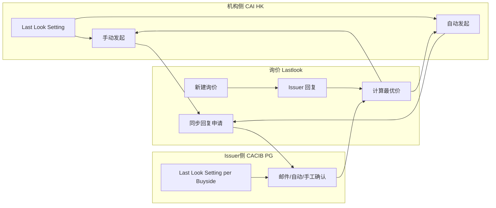

# Lastlook 知识库

EasyConnect 询价模块 **Lastlook（询价改价 / 同步最优价）** 业务知识库，供产品、开发、测试统一查阅。

| 元信息 | 内容 |
|--------|------|
| 模块路径 | `Easyconnect / quotation / lastlook` |
| 版本 | v1.2 |
| 状态 | 草案 |
| 最优价范围 | 同一笔询价下，所有 Issuer 有效回复 |
| 发起方式 | 机构 **手动** / **自动**（Organization → Last Look Setting） |
| 确认方式 | Issuer **邮件** / **自动** / **手工**（Issuer → Reply Last Look Mode） |

---

## 文档索引

| 文档 | 说明 |
|------|------|
| [01-概述与术语.md](./01-概述与术语.md) | 业务背景、核心概念与术语表 |
| [02-机构配置.md](./02-机构配置.md) | 机构 Organization → Last Look Setting（发起侧） |
| [03-Issuer端配置.md](./03-Issuer端配置.md) | Issuer → Last Look Setting（回复侧、Buyside 配对） |
| [04-业务流程.md](./04-业务流程.md) | 端到端流程、时序图、双向配置协同 |
| [05-状态与规则.md](./05-状态与规则.md) | 申请状态机、发起条件、一次性约束、失效规则 |
| [06-约束与边界.md](./06-约束与边界.md) | 比价范围、并发时效、权限、Out of Scope |
| [07-验收标准.md](./07-验收标准.md) | Given/When/Then（机构 + Issuer + 主流程） |
| [08-附录-数据字段.md](./08-附录-数据字段.md) | 申请单、机构/Issuer 配置存储字段、待确认项 |

## 资源

| 资源 | 路径 |
|------|------|
| 机构 Last Look Setting 配置基线 | [assets/lastlook-setting-config.png](./assets/lastlook-setting-config.png) |
| Issuer Last Look Setting 配置基线 | [assets/issuer-lastlook-setting-config.png](./assets/issuer-lastlook-setting-config.png) |

---

## 配置双端速览

| 端 | 入口 | 核心配置 |
|----|------|----------|
| **机构** | Organization → Last Look Setting | Matched Issuer、触发模式（Manual/Automatic）、自动条件、申请有效期、授权用户 |
| **Issuer** | Issuers → {Issuer} → Last Look Setting | Matched Buyside、Match Price Time、Reply Last Look Mode（View）、Price Validity Period |

**一句话**：非最优 Issuer 可通过 Lastlook 申请将报价同步为最优价；**机构配置**决定如何发起；**Issuer 配置**决定如何确认；双方 Buyside/Issuer 配对一致后流程才生效。

---

## 修订记录

| 版本 | 说明 |
|------|------|
| v1.0 | 初版：同步回复申请、Issuer 确认、最优价更新 |
| v1.1 | 增补机构 Last Look Setting、手动/自动发起 |
| v1.2 | 增补 Issuer 端 Last Look Setting、配置基线图、双向匹配与验收 |
